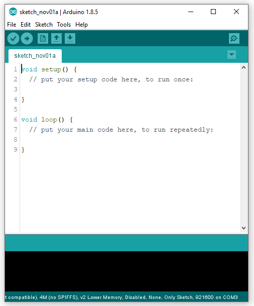
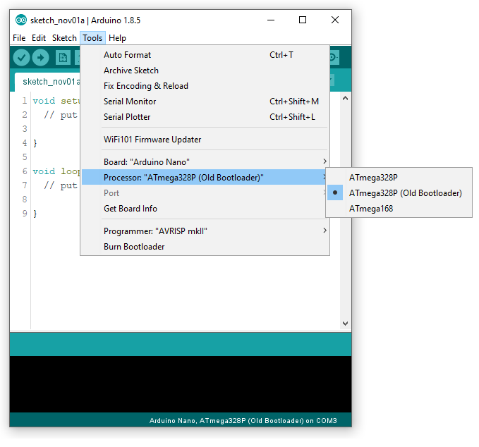

Follow the steps to install and run your first program on ARBD1
1. Install Arduino IDE from [Arduino Software](https://www.arduino.cc/en/Main/Software)
3. Arduino IDE looks like this:
    + Setup() function runs once when you press reset or power the board.
    + loop() function runs repeatedly.

4. Select Board as “Arduino Nano” in the  tools section. 
5. Select Processor as ATMEGA328P.
6. Connect the Board with your Laptop using the USB Cable.
7. Select the port.

9. If the port doesn’t show up. You need to install USB driver. For more information check the link: [Arduino Drivers](https://www.arduino.cc/en/Guide/DriverInstallation).
10. Try uploading the blank code on the board, if code still doesn’t get uploaded on the board, change the processor from “ATMEGA328P”  to “ATMEGA328P(old bootloader)”.
11. Now you are ready to start your journey. :)
12. For more information about Arduino IDE and software installation go to: [Arduino IDE Guide](https://www.arduino.cc/en/Guide)